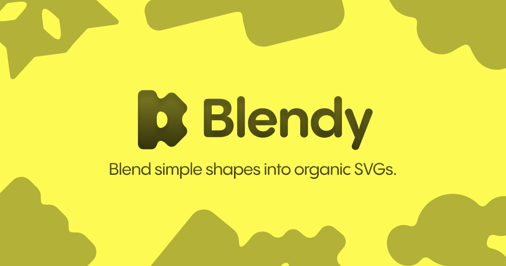

# Blendy

**Blend simple shapes into organic SVGs.**

Blendy is a browser-based shape editor. Drop rectangles, ellipses, stars and more onto a canvas, and wherever they meet they melt together into one smooth, gooey form. What you export is clean vector geometry: real paths with no blur filters, ready for any design tool.

## Features

**The goo**
- Shapes join with smooth, continuous-curvature fillets, so joins flow in without seams or creases.
- One Goo amount slider controls how far shapes reach for each other.
- Each shape keeps its exact outline; the goo only ever fills the space between different shapes.
- Give any shape its own colour; where two colours meet, the join splits down the middle.
- Dragged shapes trail the pointer on a spring, stretch as they move, and settle back.

**Editing**
- Ten shapes: rectangle, ellipse, triangle, polygon, star, cube, cylinder, cone, pyramid and torus.
- Ten presets, plus **Generate** for a random connected composition.
- Click a tile to add it at the centre, or drag it onto the canvas.
- Move, resize, rotate and round corners with on-canvas handles.
- Marquee selection, Alt + drag to duplicate, and smart guides that snap to other shapes and the artboard.
- Align, nudge, copy, cut, paste and duplicate from the keyboard. Every shortcut is listed under the help button.
- Undo and redo, up to 100 steps.

**Workspace**
- Light and dark themes. It follows your system until you pick one.
- Toggleable rulers and pixel grid. With the grid on, drags land on whole units.
- Fixed 1000 × 1000 artboard, zoomable to 300%.
- Your work is saved in your browser automatically. Nothing leaves your machine.

**Export**
- **SVG**: one path per colour, cropped to the artwork, with no filters.
- **PNG**: the same artwork at 2×, on a transparent background.

Blendy is built for desktop and laptop screens; on screens narrower than 480px it shows a notice instead.

## Getting started

Requires [Node.js](https://nodejs.org/) 18 or later.

```bash
git clone https://github.com/pixelyokai/blendy.git
cd blendy
npm install
npm run dev
```

Then open http://localhost:5173.

| Command | What it does |
| --- | --- |
| `npm run dev` | Starts the dev server with hot reload |
| `npm run build` | Type-checks and builds the production bundle into `dist/` |
| `npm run preview` | Serves the production build locally |
| `npm run typecheck` | Runs the TypeScript checker only |

## How it works

Every shape is turned into an exact signed distance field, measured to its real outline. At each point on a sampling grid, Blendy blends the three nearest shapes with a superellipse fillet. Its curvature eases to zero where it meets a shape, which is why joins look smooth rather than stitched on.

The grid is traced into an outline with marching squares. That outline is then refined against the exact distance field, so corners, tips and curves come out true. While you drag, a quick coarse pass keeps things fluid; once you stop, a sharp pass runs in a Web Worker so the interface never stalls.

## Project structure

```
src/
  editor/     React components: Canvas, Header, Toolbar, Sidebar, Fields, Rulers
    ui/       icons, tooltips and menus
  goo/        the outline engine: distance fields, fillet blend, marching squares,
              exact refinement, and the Web Worker for the sharp pass
  geometry/   shape paths, bounds, resize, rotation, snapping, drag bend
  model/      document, shapes and presets, plus validation of saved data
  state/      Zustand stores: the document with undo history, and view preferences
  presets/    preset definitions and the random generator
  export/     SVG and PNG export
  utils/      small helpers
```

The geometry and goo modules are plain TypeScript with no DOM dependencies, so they also run in Node.

**Stack:** React 18, TypeScript, Vite and Zustand. There are no other runtime dependencies.

## Deploying

Blendy is fully client-side, with no backend and no environment variables. Deploy it to any static host. On Vercel, choose the **Vite** framework preset (build command `npm run build`, output directory `dist`); `vercel.json` adds a few security headers.

## License

[MIT](LICENSE) © pixelyokai
